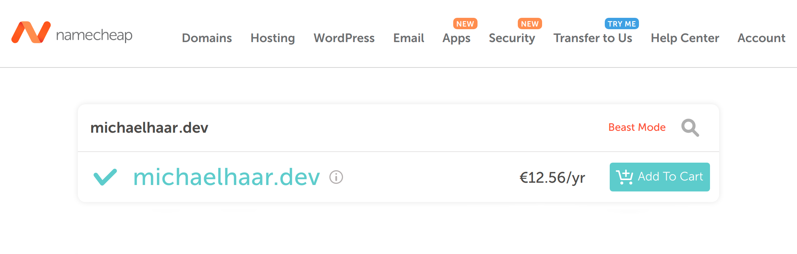
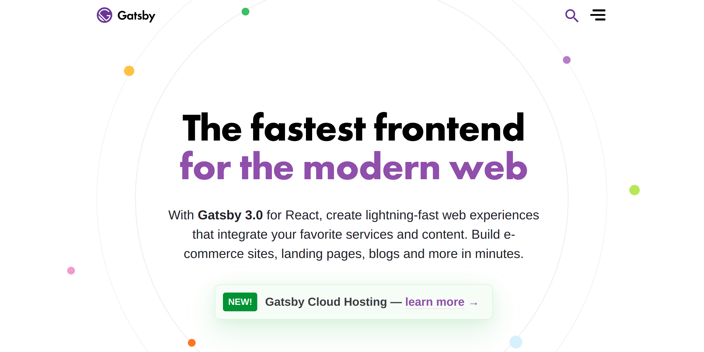
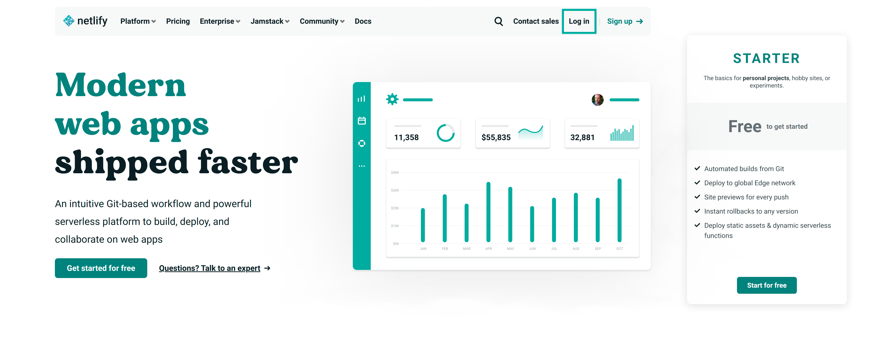
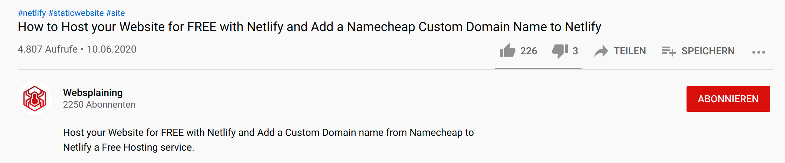
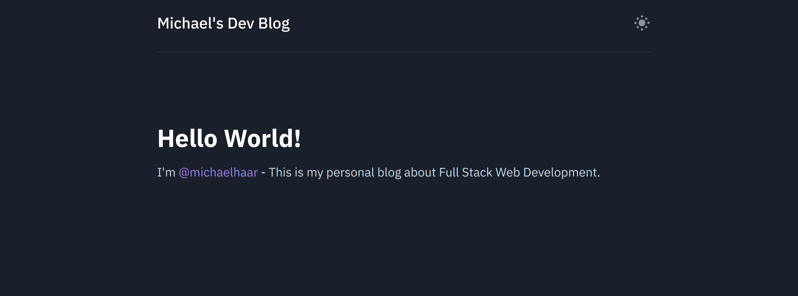

I always wanted to have my own personal blog. Finally I had some time
to build it. 🚀💪

# Requirements

This is my first blog ever and therefore I wasn't really sure what I can expect.
Usually I start new projects by thinking about the requirements, which gives me
a nice overview of the project's structure and architecture.

I came up with the following expectations/requirements:

- My blog should have a custom URL/domain. 📭
  - (like `michaelhaar.dev` or `michaelhaar.at`).
- It should be minimalistic.
  - (All I need are just some code blocks and images!?)
  - I wanted a nice simplistic welcome page that lists the latest posts.
- There shouldn't be any advertisements, which distracts the user from the content
- I wanted to build it by myself. 🧑‍💻
  - Because I'm a Full Stack Developer 😉
  - (At first I was thinking of some HTML and CSS files, which are stored in a github
    repository ... similar to the [Udacity Git Style Guide] which is served
    directly form the [git-styleguide Github repository].)
- Total costs should be less than 100€ per year.

# Realization/Implementation Steps

Next, I had to do the time consuming part ... the realization of my plans and dreams.

## 1. Buying a Domain

The first thing I did was buying a domain name. Actually this step was really easy
although it was my first time buying a domain. 🤷

First, I searched for `biggest domain registrars` on Google, which gave me the
following result:

- Domain.com
- Bluehost
- HostGator
- GoDaddy
- Namecheap
- DreamHost
- Shopify
- BuyDomains

After that, I checked the availability and the price of my desired domain name
on those sites. I ended up buying the domain name `michaelhaar.dev` at
[Namecheap] for approximately 12€-13€ per year including taxes and privacy
protection, which is a really great deal in my opinion. 👍

## 2. Building the Blog Website.

As already mentioned in the requirements section I wanted to build the blog by
myself or at least most parts of it. (I also tried [WordPress] but I
didn't like it.) 🧑‍💻

At first I wanted to write my blog posts directly in HTML and CSS, but I
realized, that it might be difficult to be consistent with all the styles and
components. Therefore I decided to write my blog posts in markdown files and
use [Gatsby] to convert them into static HTML/CSS/JS files, which can be easily
distributed and hosted.

Please check out my next blog post , where I provide an
in-depth explanation of how I did this.

After that, I searched for `Platforms to Host Static HTML Sites` on Google and
it gave me these results:

- Netlify
- Vercel
- Firebase
- Fast.io
- Render
- Gitlab
- GithubPages
- Amazon AWS Amplify

I decided to use [Netlify], because it has all the features that I want (zero
costs, automatic deployment from Github and many Gatsby examples use Netlify). 🚀

## 3. Forwarding Requests to our Webserver

Next I had to make sure that requests to `michaelhaar.dev` are forwarded to the
correct webserver. 🌍

Computers in the internet can be addressed by their IP addresses, which usually look
something like this: `192.168.13.2`. Unfortunately these numbers are very hard to
remember for our human brains. Therefore we introduced domain names, which are
basically human friendly representations of the IP-addresses. The
mapping/translation from the readily memorized domain names to the numerical IP
addresses is done by the [domain name system], which is probably one of the most
important services in IP based networks. We created a new domain name and
therefore we have to tell the domain name system the IP address of our associated
webserver. 📭

I think this [video from websplaining] perfectly explains the required steps:

These are the relevant timestamps for our project:

- Add a custom domain name to Netlify 4:15​
- Point your Domain Hosts NameServers to Netlify's DNS 6:59​
- Enable automatic TLS certificates with Let’s Encrypt​ 8:58​
- Check the live website 9:49

# Discussion & Requirement Verification

I'm really happy with the end result of my personal blog, because

- it has a **minimalistic design** with a clean welcome page 🙏,
- it **doesn't show any ads**,
- it's **fully customizable** 🗽,
- it lets me write my blog post in **markdown files**,
- it is **lightning-fast**,
- it offers **light mode / Dark Mode** as well as **advanced code block options**,
- it's available at my **favorite domain name**,
- and it only costs me about **12-13€ per year** 💎

# Summary

Yaaay!! I did it! 🥳🙌🎉

- First, I started by thinking about the requirements.
- Then I bought the domain name `michaelhaar.dev`.
- Next I created a new Github repository, added a Gatsby Blog
  example, customized it and hosted the static HTML site on Netlify.
- Finally I had to link my domain name and the IP-address of the Netlify server
  together by changing the DNS.

[udacity git style guide]: http://udacity.github.io/git-styleguide/
[git-styleguide github repository]: https://github.com/udacity/git-styleguide/
[wordpress]: https://wordpress.com
[namecheap]: https://www.namecheap.com/
[changing the dns]: https://www.namecheap.com/support/knowledgebase/article.aspx/767/10/how-to-change-dns-for-a-domain/
[gatsby]: https://www.gatsbyjs.com/
[netlify]: https://www.netlify.com/
[video from websplaining]: https://www.youtube.com/watch?v=T9L8aWTPTLA
[domain name system]: https://en.wikipedia.org/wiki/Domain_Name_System
