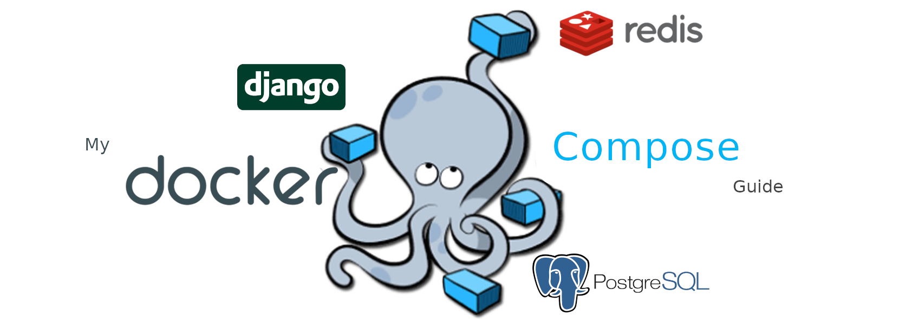
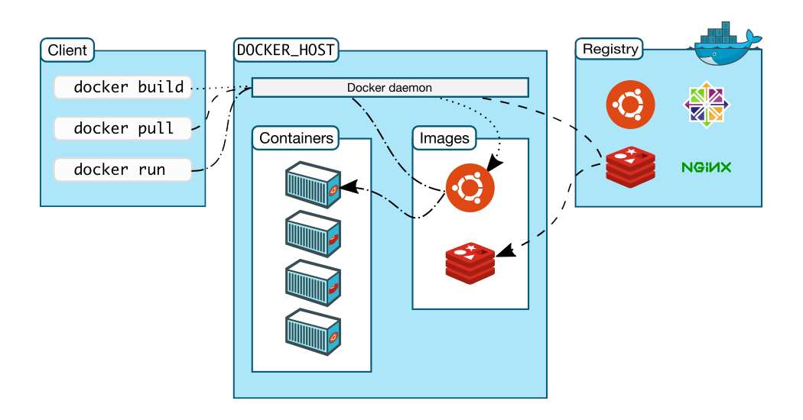
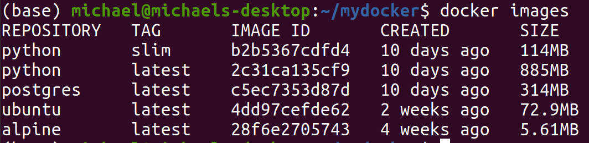

Most web applications require multiple services, which need to work in parallel.
One for the database, one for the webscraper, one for the Django Webserver, one
for the Background Tasks and so on.

> The proper setup, configuration and documentation of all those services gets
> difficult very quickly. One solution is to automate these steps with [Docker]
> and [Docker-Compose].

This article is basically a cheatsheet containing my most used docker commands.

# Terminology 🧑‍🏫

This section will explain the following terms:

- Docker
- Image
- Dockerfile
- Container
- Volumes
- Docker-Compose


_Docker Architecture (Source: https://docs.docker.com/get-started/overview/#docker-architecture)_

[Docker] enables us to create lightweight virtual machines on our desktop that
behaves like a full separate computer. The setup and configuration of those
virtual machines **can be automated** by using [Images] and [Dockerfiles].
Images are blueprints or a read-only template with instructions for creating
a Docker container.

We can think of Docker [Containers] as a lightweight virtual machine or a runnable
instance of an image. We can **build**, **start**, **stop**, move, or delete a
container using the Docker API or CLI. We can connect a container to one or more
networks, attach storage to it, or even create a new image based on its current
state.

Next, I have to explain [Volumes]. Volumes enables us to mount a folder in the
physical file system of our desktop (=host) machine into the virtual file system of a
Docker container. So what happens is that when the container writes data to it's
filesystem it gets replicated or automatically written on the host file system
and vice versa. This is extremely useful for development. If we make changes
to the files in our code editor, those changes are immediately visible in
the Docker container.

Next, we need a program called [Docker-Compose]. It's very common for
applications to consist of multiple
containers/services. Manually starting and stopping all
those services can be very annoying and is prone to errors. This is where
Docker-Compose comes it play. Compose is a tool for defining and running
multi-container Docker applications. With Compose, we use a YAML file to configure
our application’s services. Then, with a single command, we create and start
all the services from our configuration.

## Summary 💡

- **Docker** enables us to create lightweight virtual machines (=containers)
- **Images** are blueprints or templates for these containers
- **Dockerfiles** can be used to build images automatically by reading the
  instructions.
- **Container** is a runnable instance of the image (=lightweight virtual machine)
- **Volumes** allow us to share files between the host and the container
- **Docker-Compose** is a tool for managing multi-container Docker applications.

# Prerequisites / Installation

Make sure **Docker** and **Docker-Compose** are installed on your machine by typing
`docker-compose version` into your terminal program. It should show you the
installed version of Docker Compose. Otherwise please follow the
official [Docker Compose Install Guide] for your operating system.

Note for Ubuntu users:

1. Install Docker as descriped [here](https://docs.docker.com/engine/install/ubuntu/)
2. Do the [post install steps](https://docs.docker.com/engine/install/linux-postinstall/)
3. Install Docker-Compose as descriped [here](https://docs.docker.com/compose/install/)

# Docker Command Guide 🚀

This is a summary of my most used docker command line commands:

### Generic

- [`docker --version`](https://docs.docker.com/engine/reference/commandline/version/)
  shows the Docker version information.
- [`docker --help`](https://docs.docker.com/engine/reference/commandline/docker/)
  displays the available Docker commands.
- [`docker system`](https://docs.docker.com/engine/reference/commandline/system/)
  manage Docker.

### Images

- [`docker images`](https://docs.docker.com/engine/reference/commandline/images)
  shows all images.
- [`docker pull`](https://docs.docker.com/engine/reference/commandline/pull)
  pulls an image from registry to local machine.
- [`docker rmi`](https://docs.docker.com/engine/reference/commandline/rmi)
  removes an image.
- [`docker build`](https://docs.docker.com/engine/reference/commandline/build)
  creates image from Dockerfile.
- [`docker image`](https://docs.docker.com/engine/reference/commandline/image/)
  manage images.

### Containers

- [`docker ps`](https://docs.docker.com/engine/reference/commandline/ps/)
  list containers (ps stands for process status).
- [`docker run`](https://docs.docker.com/engine/reference/commandline/run)
  creates and starts a container in one operation.
- [`docker create`](https://docs.docker.com/engine/reference/commandline/create)
  creates a container but does not start it.
- [`docker rm`](https://docs.docker.com/engine/reference/commandline/rm)
  deletes a container.
- [`docker start`](https://docs.docker.com/engine/reference/commandline/start)
  starts a container so it is running.
- [`docker stop`](https://docs.docker.com/engine/reference/commandline/stop)
  stops a running container.
- [`docker container`](https://docs.docker.com/engine/reference/commandline/container/)
  manage containers

### Volumes

- [`docker volume`](https://docs.docker.com/engine/reference/commandline/volume/)
  manage volumes.

### Examples

```bash
# display docker version to test proper installation
docker --version

# display help (please note that the --help flag works on every docker command)
docker --help

################################# IMAGES #######################################

# List all images that are locally stored with the Docker Engine
docker images --all

# Pull an image called `python:alpine` from the official Docker Hub
# (see: https://hub.docker.com/_/python)
docker pull python:alpine

# Delete/remove the image with id `2c31ca135cf9` from the local image store
docker rmi 2c31ca135cf9


################################## CONTAINERS ##################################

# List all containers
docker ps --all

# Create and start a new docker container from an image called `python:alpine`
# (Note: the flags `-i` and `-t` can be combined to `-it`)
# (If you want to detach from a running container, try `Ctrl + d` or  `Ctrl + c`)
docker run -it python:alpine

# Delete/Remove the container with id `661f5cfb0881`
docker rm 661f5cfb0881


################################# CLEAN-UP #####################################

# Stop all running containers
docker stop $(docker ps -a -q)

# Show a summary of the space currently used by different docker objects.
# (df stands for disk free)
docker system df

# Remove unused data (this command is considered to be safe)
# This will remove:
#   - stopped containers
#   - unused networks (not used by at least one container)
#   - unused volumes (not used by at least one container)
#   - unused images (not referenced by any container)
#   - build cache
docker system prune --all --volumes

################################ DANGER-ZONE ###################################

# Delete ALL containers (running and stopped containers)
docker rm -f $(docker ps -qa)

# Delete ALL images (used and unused)
docker rmi -f $(docker images -q)

# Delete ALL volumes (used and unused)
docker volume rm $(docker volume ls -q)
```

# Docker-Compose Guide 🚀

## Basic Usage

With Compose, we use a YAML file to configure your application’s services.

```yaml
# `docker-compose.yml` example file
version: "3.9" # optional since v1.27.0
services:
  web:
    build: .
    ports:
      - "80:8000"
    volumes:
      - .:/code
    depends_on:
      - db
  db:
    image: postgres
    volumes:
      - db-data:/var/lib/postgresql/data
volumes:
  db-data: {}
```

Let's break down the code from above:

```yml
# specify the Compose file version for backward compatibility.
version: "3.9"

# define two services called `web` and `db`.
services:
  web:
    # Set build options ("context" and Dockerfile).
    # A build’s context is the set of files located in the specified path or
    # url. The build process can refer to any of the files in the context.
    # For example, your build can use a `COPY` instruction to reference a
    # file in the context.
    # (see: https://docs.docker.com/engine/reference/commandline/build/)
    #
    # current directory is used in this case.
    build: .

    # map TCP port 80 in the host system to port 8000 on the container.
    # Host_Port:80 <==> Container_Port:8000
    ports:
      - "80:8000" # HOST:CONTAINER

    # Mount host paths or named volumes, specified as sub-options to a service.
    volumes:
      # The short syntax is uses the generic SOURCE:TARGET format.
      # SOURCE can be either a host path or volume name
      # TARGET is the container path where the volume is mounted
      #
      # current directory on the host machine is mounted to `/code` directory
      # in the container.
      - .:/code # HOST_PATH:MOUNTED_CONTAINER_PATH

    # Express dependency between services
    # `docker-compose up` starts services in dependency order.
    #
    # `db` is started before `web`.
    depends_on:
      - db
  db:
    # Build the service from an image called `postgres`
    # see: https://hub.docker.com/_/postgres
    image: postgres

    # Please check out the generic volume description in the `web` service.
    volumes:
      # Mount the named volume `db-data`.
      - db-data:/var/lib/postgresql/data # VOLUME_NAME:MOUNTED_CONTAINER_PATH

# Defines a named volume called `db-data`.
#
# The contents of that volume (even if they are changed via a process in the
# container) will persist through the containers lifecycle even when stopped/removed.
volumes:
  db-data:
```

### CLI Commands

```bash
# Builds, (re)creates, starts, and attaches to containers for a service.
docker-compose up

# Stops running containers without removing them.
docker-compose stop
# (They can be started again with docker-compose start.)
docker-compose start

# Run a one-time command against a service. For example, the following command
# starts the `web` service and runs `bash` as its command.
docker-compose run web bash

################################ DANGER-ZONE ###################################

# Stop containers and remove containers, networks, volumes, and images created
# by `up`.
docker-compose down
```

# Troubleshooting 😠

## "Low Disk Space on Filesystem root"

One day I got the warning "low disk space on filesystem root", which was
something I did not expect. Therefore it might be worth mentioning that images
were stored in the root directory of my ubuntu machine (images were stored in
the following directory: `/var/lib/docker/`). I realized that I had too many large
(unused) images which consumed my disk space.

You can pull some images and run `docker images` to see their actual image size.
Here are some examples:

- [alpine](https://hub.docker.com/_/alpine): 5-6MB
- [ubuntu](https://hub.docker.com/_/ubuntu): 70-80MB
- [python:slim](https://hub.docker.com/_/python): ~115MB
- [postgres](https://hub.docker.com/_/postgres): ~300MB
- [python](https://hub.docker.com/_/python): ~900MB



If you run into disk space constraints please consider deleting some images
and/or try to use smaller image versions like the `slim` or `alpine` tag of
the `python` image.

[docker]: https://www.docker.com/
[docker-compose]: https://docs.docker.com/compose/
[images]: https://docs.docker.com/get-started/overview/#images
[dockerfiles]: https://docs.docker.com/engine/reference/builder/
[containers]: https://docs.docker.com/get-started/overview/#containers
[volumes]: https://docs.docker.com/storage/volumes/
[docker compose install guide]: https://docs.docker.com/compose/install/
