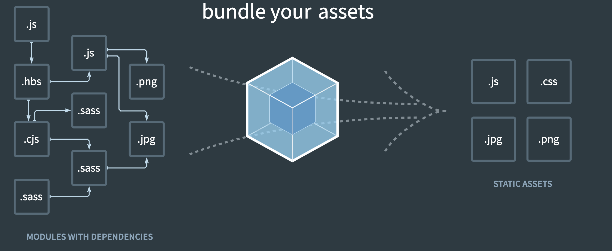

This blog post is part my knowledge management and explains why we need Webpack
and Babel for modern frontend web development.

## The Problem

> Credit goes to Nitish Dayal: [Create-React-App: A Closer
> Look](https://github.com/nitishdayal/cra_closer_look)

As single-page applications and the needs of our users have grown
in complexity, so has the landscape of front-end development. Modern
single-page applications can consist of multiple JS files _communicating with
one another_ in order to manipulate the DOM, reducing (and in some cases
eliminating) the need to request files from a server to update an
application's UI. To allow for these JavaScript files, or _modules_, to
interact efficiently in the browser, one option is to take advantage of a
**module bundler**. A module bundler will parse through our code, mapping out
dependencies as it comes across them, to **bundle** our application together
in a way that the browser can understand, while still allowing developers to
maintain modularity and separation in the codebase.

Some React developers write their applications using ES2015+ to utilize
the benefits provided by the latest JavaScript syntax. However, browser
support for changes to the JavaScript language are inconsistent at best, and
we want users of our applications to have the same experience regardless of
their browser choice. To ensure that our applications will run consistently
and smoothly across browsers, we need to **transpile** our code from ES2015
down to a version of JavaScript that has better support across popular
browsers.

## Babel

[Babel](https://babeljs.io/) is a Javascript compiler. It is mainly used to
convert or _transpile_ ECMAScript 2015+ code into a backwards compatible version
of JavaScript in current and older browsers or environments.

```js
// Babel Input: ES2015 arrow function
[1, 2, 3].map((n) => n + 1);

// Babel Output: ES5 equivalent
[1, 2, 3].map(function (n) {
  return n + 1;
});
```

## Webpack

[webpack](https://webpack.js.org/) is a static module bundler for modern JavaScript applications.

> Simply speaking module bundlers merge multiple javascript files together into
> a single file, which can be easily added to the HTML code. But module bundlers
> can do much more...



When webpack processes your application, it internally builds a dependency graph
which maps every module your project needs and generates one or more bundles.

Out of the box, webpack only understands JavaScript and JSON files. _Loaders_
allow webpack to process other types of files and convert them into valid
modules that can be consumed by your application and added to the dependency
graph. The babel-loader for example tells the webpack's compiler the following:

> "Hey webpack compiler, when you come across a path that resolves to a '.js'
> file inside of a require()/import statement, use the babel-loader to transform
> it before you add it to the bundle."

## Summary

- Javascript language constantly evolves
- Babel is used to transpile Javascript files
  - Developers can use the latest Javascript features
  - Babel makes sure older browsers can understand it
- Webpack merges/bundles our Javascript files
  - Developers can organize our code in multiple files
  - Webpack bundles those files together, so that it can be easily added
    to the HMTL

## Resources

- [Babel Docs](https://babeljs.io/docs/en/)
- [Webpack Concepts](https://webpack.js.org/concepts/)
- [Create React App](https://github.com/facebook/create-react-app)
- [Create-React-App: A Closer Look](https://github.com/nitishdayal/cra_closer_look)
